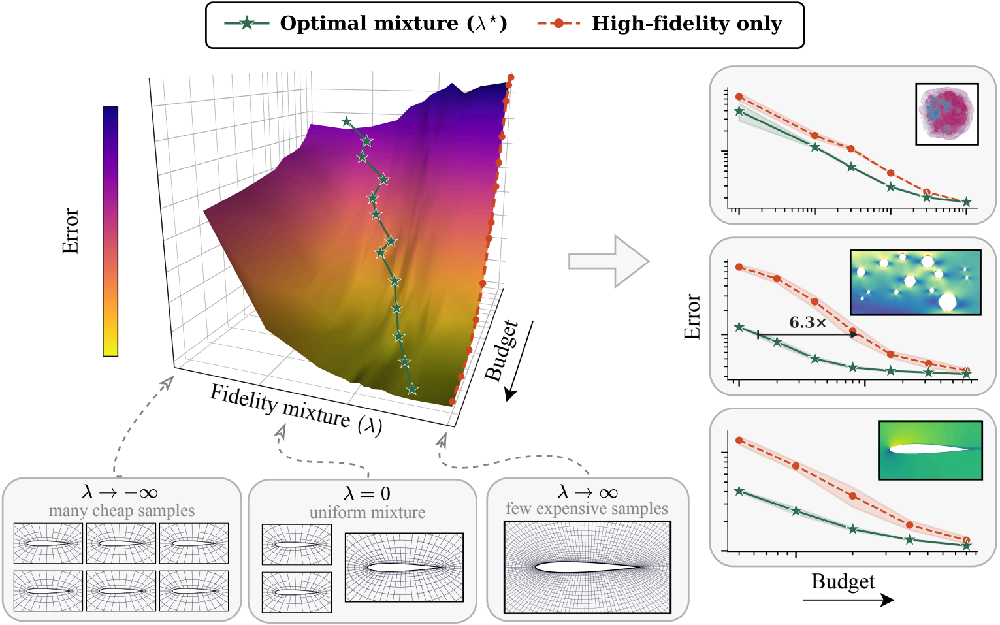

# Compute-optimal data scaling for neural surrogates via multi-fidelity training

<div align="center">

<!-- TODO: replace the arXiv id once the paper is on arXiv, and the project page URL once it exists -->
[](https://psetinek.github.io/multi-fidelity-neural-surrogates/)
[](https://arxiv.org/abs/2506.12007)
[](https://huggingface.co/datasets/psetinek/multi-fidelity-airfoil)
[](LICENSE)



</div>

> **Paul Setinek\*, Fabian Paischer, Nils Thuerey, Johannes Brandstetter, Felix Koehler\***

This is the official repository for "..." presented at NeurIPS 2026.

## Repository structure

We split the grid and mesh experiments into two different folders containing all experiments of the paper:

| folder | experiments | architectures |
|---|---|---|
| [`grid/`](grid) | Poisson equation on 1D, 2D and 3D grids (discretization and solver error) | FNO, U-Net |
| [`mesh/`](mesh/README.md) | linear elasticity and hyperelasticity on 2D meshes (discretization and solver error), RANS airfoils (discretization error) | Transolver, AB-UPT |

Each folder is self-contained, with its own installation instructions, data generation, training
and evaluation code, and the results and scripts behind its figures in the paper.

## Data

The airfoil dataset (1,627 cases, 11 mesh levels each, ~107 GB) is available on [Hugging Face.](https://huggingface.co/datasets/psetinek/multi-fidelity-airfoil).
The other datasets are generated with the pipelines in the respective folder and can be regenerated on the fly or stored locally.

## Citation

If you find this work useful, please cite:

```bibtex
TODO: add arxiv citation
```

## License

This project is licensed under the [MIT License](LICENSE).
